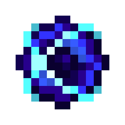
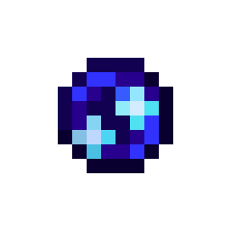

---
navigation:
  parent: items-blocks-machines/items-blocks-machines-index.md
  title: Singularities
  icon: singularity
item_ids:
- ae2:singularity
- ae2:quantum_entangled_singularity
---

# Singularity

A very compact ball of matter.

Made with 256,000 items in a <ItemLink id="matter_condenser" /> in singularity mode.

# Quantum Entangled Singularity

Required to create a connection between two [Quantum Network Bridges](quantum_bridge.md), they are always produced in matching
pairs. To create a connection place 1 of the pair of quantum entangled singularities into the <ItemLink id="quantum_link" /> of
the bridge on each side.

They are crafted by causing a reaction between <ItemLink id="minecraft:ender_pearl"/> or <ItemLink id="ender_dust"/>  
and a <ItemLink id="singularity"/>. Any explosive force should be enough to trigger the reaction.

<RecipeFor id="quantum_entangled_singularity" />

**_Nearly any explosion - even creepers - will work._**

Always produced in pairs, but only require a single <ItemLink id="singularity"/>.

It might be a good idea to label these with names when you create them using the vanilla anvil.
