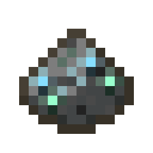

---
navigation:
  parent: items-blocks-machines/items-blocks-machines-index.md
  title: Sky Stone Dust
  icon: sky_dust
item_ids:
- ae2:sky_dust
---
# Sky Stone Dust

A <ItemLink id="sky_stone_block"/> block that has been crushed by an <ItemLink id="inscriber"/>. Used in the production of
<ItemLink id="cell_component_256k"/> and <ItemLink id="sky_stone_block"/>.

Can also be obtained by pointing an <ItemLink id="annihilation_plane"/> upward at world height limit.

# Recipe

<RecipeFor id="sky_dust" />