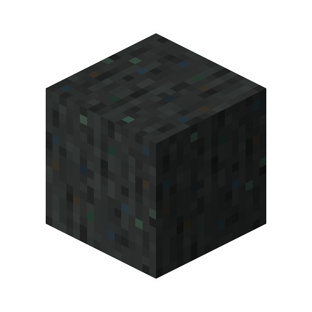

---
navigation:
  parent: items-blocks-machines/items-blocks-machines-index.md
  title: Sky Stone
  icon: sky_stone_block
item_ids:
- ae2:sky_stone_block
- ae2:smooth_sky_stone_block
- ae2:sky_dust
---
# Sky Stone

The material [meteorites](./features/meteorites.md) are made out of, used in the recipes of the <ItemLink id="sky_stone_tank" />, <ItemLink id="not_so_mysterious_cube" />,
<ItemLink id="cell_component_256k" />, and most importantly, the <ItemLink id="controller" />.

# Recipe

place an annihilation plane facing up at max worldheight to get sky stone dust

<RecipeFor id="sky_stone_block" />
<RecipeFor id="smooth_sky_stone_block" />
<RecipeFor id="sky_dust" />