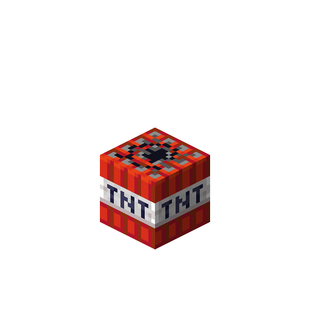

---
navigation:
  parent: items-blocks-machines/items-blocks-machines-index.md
  title: Tiny TNT
  icon: tiny_tnt
item_ids:
- ae2:tiny_tnt
---
# Tiny TNT

Small TNT for small explosions. Useful for making <ItemLink id="quantum_entangled_singularity"/> pairs.

It can have its block damage disabled in the config to allow making singularities without the possibility
of griefing, if you want to disable TNT and creepers on your server.

# Recipe

<RecipeFor id="tiny_tnt" />