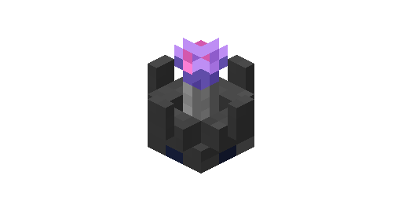

---
navigation:
  parent: items-blocks-machines/items-blocks-machines-index.md
  title: Wireless Access Point
  icon: wireless_access_point
item_ids:
- ae2:wireless_booster
- ae2:wireless_access_point
---
# The Wireless Access Point

Allows wireless access via a <ItemLink id="wireless_terminal" />.
Range and power usage is determined based on the number of <ItemLink id="wireless_booster" /> installed.

A network can have any number of wireless access points with any number
of <ItemLink id="wireless_booster" /> in each one, allowing you to optimize power usage
and range by altering your setup.

Requires a [channel](channels.md).

# Recipes

<RecipeFor id="wireless_access_point" />

Used to increase the range of the <ItemLink id="wireless_access_point"/>.

<RecipeFor id="wireless_booster" />
