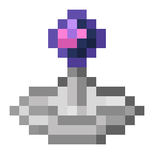

---
navigation:
  parent: items-blocks-machines/items-blocks-machines-index.md
  title: Wireless Receiver
  icon: wireless_receiver
item_ids:
- ae2:wireless_receiver
---
# Wireless Receiver

A <ItemLink id="fluix_pearl" /> in a reflector dish, a component of short-range wireless ME technology.

# Recipe

<RecipeFor id="wireless_receiver" />