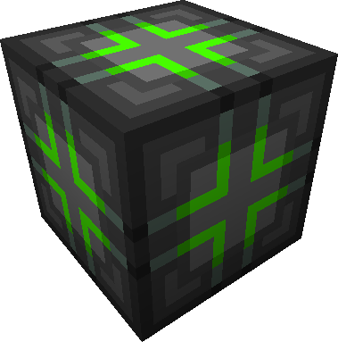
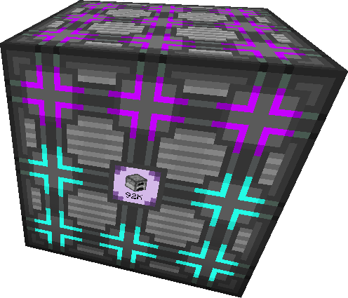

---
navigation:
  parent: website/index.md
  title: Auto-Crafting
  icon: molecular_assembler
item_ids:
  - ae2:blank_pattern
  - ae2:crafting_pattern
  - ae2:processing_pattern
  - ae2:1k_crafting_storage
  - ae2:4k_crafting_storage
  - ae2:16k_crafting_storage
  - ae2:64k_crafting_storage
  - ae2:crafting_accelerator
  - ae2:crafting_monitor
  - ae2:crafting_unit
  - ae2:pattern_provider
  - ae2:cable_pattern_provider
---

## Crafting CPU

Manages a single auto crafting task from start to finish, built of various crafting units.

To be a valid crafting CPU, two rules must be met:

1. The CPU must be a cuboid, completely composed of the parts listed above; air or other blocks are not valid.
2. The CPU must contain at least 1 storage component.

The crafting CPU as a multi-block only requires a single channel for the
entire structure. Crafting co-processors increase the number of tasks the
crafting CPU can perform at once; with no co-processors, the crafting CPU can
perform a single task at a time. Storage requirements are moderately
complicated, and do not follow the usual ME storage math, but for a first
approximation, you will need a little over one byte per input item, output
item, or operation.

You can name your Crafting CPUs by naming any of the crafting units it is made up of with
an <ItemLink id="inscriber"/> or an Anvil.

To provide patterns to the autocrafting cpus you can use <ItemLink id="interface"/>
or <ItemLink id="level_emitter"/>.

### Components

#### Crafting Unit

This particular block provides the CPU with no additional features, but can be used as a "filler" block.
It is the base for crafting the other functional components of a crafting CPU.

#### Crafting Storage

Provides 1024 bytes of storage for crafting.

<RecipeFor id="1k_crafting_storage" />

Provides 4,096 bytes of storage for crafting.

<RecipeFor id="4k_crafting_storage" />

Provides 16,384 bytes of storage for crafting.

<RecipeFor id="16k_crafting_storage" />

Provides 65,536 bytes of storage for crafting.

<RecipeFor id="64k_crafting_storage" />

#### Co-Processor

<FloatingImage src="../assets/large/craftingco.png" align="left" alt="A picture of several Co Processors in a Crafting CPU" />
Provides additional item delivery from the CPU to the <ItemLink id="pattern_provider"/> for
crafting.

This can be used to make more assemblers active in parallel for the job, and
thus increase overall crafting speed. These only help if your setup has steps
properly separated so the system can run multiple tasks in parallel, or even
split the same pattern across multiple interfaces.

<RecipeFor id="crafting_accelerator" />

 

#### Crafting Monitor

Displays the top level job and its current progress so you can see what a particular Crafting CPU is currently
working on.

<RecipeFor id="crafting_monitor" />

## Pattern Provider

Recipes need to be encoded into patterns to be usable by crafting CPUs. The encoded patterns need to be put
into pattern providers on the same network as the Crafting CPU itself. When the crafting CPU then
needs to craft the primary result of that pattern, it'll delegate this to the
pattern provider. Normally, the pattern provider will then push out the
ingredients to an adjacent block (a <ItemLink id="molecular_assembler"/> for crafting recipes, for example),
and crafting continues once the result enters the network again.
This can be achieved by pushing the crafting result back into the pattern provider,
an <ItemLink id="interface" /> or any other means that would import the crafting result into the network. Molecular
assemblers are smart enough to automatically return the crafting result to the same pattern provider that provided
the ingredients.

<RecipeFor id="pattern_provider" />
<RecipeFor id="cable_pattern_provider" />

### Blank Pattern

A blank pattern, once encoded as an <ItemLink id="crafting_pattern"/>
or <ItemLink id="processing_pattern"/>, is used to control
crafting by inserting them into <ItemLink id="molecular_assembler"/> and <ItemLink
id="pattern_provider"/>.

Patterns can be encoded in the <ItemLink id="pattern_encoding_terminal" />.

<RecipeFor id="blank_pattern" />

### Crafting Patterns

Encoded version of <ItemLink id="blank_pattern"/> created by using
the <ItemLink id="pattern_encoding_terminal"/> in "Crafting Mode".

Crafting Recipes are very specific, and automatically have an output
associated with them, these are required to work with a <ItemLink
id="molecular_assembler"/>.

The description of a crafting pattern starts with "Crafts".

### Processing Recipes

Encoded version of <ItemLink id="blank_pattern"/> created by using
the <ItemLink id="pattern_encoding_terminal"/> in "Processing Mode".

Processing recipes are not crafting recipes, they have no rules to their
inputs, or outputs, and are used for things like machines or furances, they
can support up to 9 different inputs, and up to 3 diffrent outputs ( these
outputs cannot be random chance, each output must still be a 100% chance. )

The description of a processing pattern starts with "Creates".
