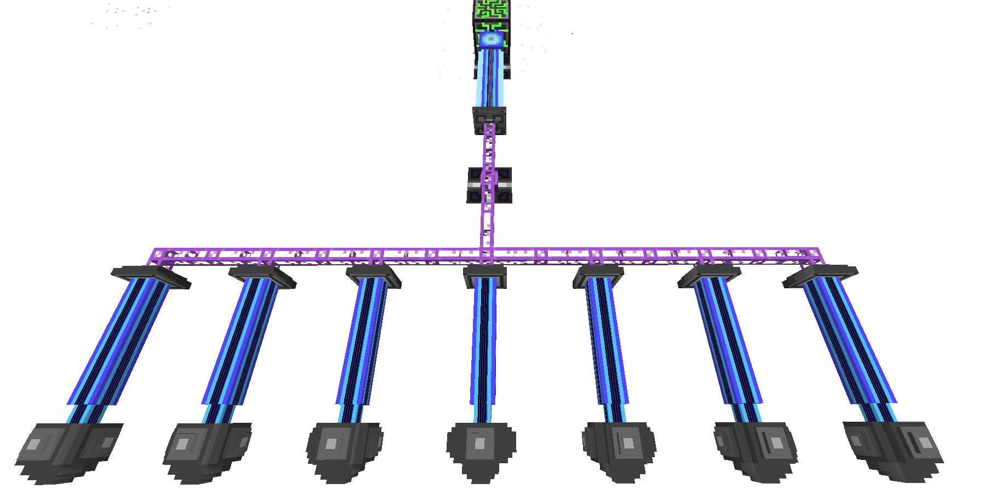

---
navigation:
  parent: website/index.md
  title: Getting Started  (1.19+)
---

  The following information only applies to Applied Energistics 2 in Minecraft
  1.19 and newer.

## Early Game Progression

- Build a <ItemLink id="charger" />, and power it with a <ItemLink id="vibration_chamber" /> or a generators from others
  mods. You can also power it by hand using a <ItemLink id="crank" />.
- Put a Vanilla compass in the charger and charge it to craft a <ItemLink id="sky_compass" />.
- Use the meteorite compass to find meteorites, which have a chance to contain quartz blocks and budding quartz.
- To progress, you need to create <ItemLink id="fluix_crystal" />. You have two options:
  - Use the compass to find a [meteorite](./features/meteorites.md), where you might find
    some <ItemLink id="fluix_crystal" />.
- To craft the processors required for more advanced machines, you'll need the <ItemLink id="inscriber" />. Each type of
  processor has an associated press, which you will find in [meteorites](./features/meteorites.md).

## My Very First Quartz

The first step to getting started in AE2 is to acquire Quartz. AE2 itself
adds <ItemLink id="certus_quartz_crystal"/>, and makes use of
vanilla's <ItemLink id="minecraft:quartz"/> as well. The first tier of AE2 tech, such as
the <ItemLink id="certus_quartz_wrench"/>
, <ItemLink id="certus_quartz_cutting_knife"/>,
and [Certus Quartz tools](./features/simple-tools/quartz-tools.md), use <ItemLink id="certus_quartz_crystal" /> as the
primary crafting ingredient.

The primary way of obtaining quartz is from breaking quartz crystal clusters. These grow on budding quartz in a way
that is similar to Vanillas amethyst. Budding quartz decays when growing buds, but can be recharged using <ItemLink id="charged_certus_quartz_crystal" />
in a puddle of water. New budding quartz can be created the same way by using a <ItemLink id="quartz_block" />.

Meteorites will sometimes contain a flawless budding quartz.

## Alright, I have a bunch of Certus and Nether Quartz; how do I move up in the world?

After some investigation, you've probably noticed that to move up through the tech tree you
need <ItemLink id="fluix_crystal"/>. <ItemLink id="fluix_crystal"/> are made through the following
process:

Throw <ItemLink id="charged_certus_quartz_crystal" />, <ItemLink id="minecraft:quartz"/>, and <ItemLink id="minecraft:redstone"/> into a pool of
water and wait. This will create <ItemLink id="fluix_crystal" />.

You can create <ItemLink id="charged_certus_quartz_crystal"/> in a Charger, which can be powered
by a <ItemLink id="vibration_chamber" /> full of coal.

Since growing crystals without any accelerators takes a long time, you should invest your first fluix crystals into
building as many <ItemLink id="quartz_growth_accelerator" /> as you can.

After this, you're set to start on the next level of tech with an <ItemLink id="inscriber" />.

## Unlocking Technology - Hunting For The Last Few Pieces

### I can't make any of the circuits, and the plates for the Inscriber don't have a crafting recipe. Is AE2 broken?

No, AE2 isn't broken. The "final" pieces of the AE2 puzzle needed to move up the tech tree into ME Networks are the
Inscriber Presses. There are four presses that you need (Listed in order of "tier"):

<ItemGrid>
  <ItemIcon id="silicon_press" />
  <ItemIcon id="logic_processor_press" />
  <ItemIcon id="calculation_processor_press" />
  <ItemIcon id="engineering_processor_press" />
</ItemGrid>

These presses are used to make the Circuits needed for the Tech 2 machines and beyond. They're found randomly
in <ItemLink id="sky_stone_chest"/>, which are located within Meteorites. Meteorites are randomly
spawned throughout the world, normally underground. So, the hunt begins!

This hunt is a little less aimless than the hunt for your first <ItemLink id="
charged_certus_quartz_crystal"/>. You'll have a tool to help you on your way, the <ItemLink id="
sky_compass"/>. The Compass will point you toward the chunk the meteor has generated in, not the specific block or the
center of the meteor itself. You'll have to do some digging and searching in order to find the meteor, and then you'll
have to take it apart and find the center, which is where the <ItemLink id="sky_stone_chest"/> will
be located.

### I did it!

After this is where the fun starts. You now have all the tools to start making the complex pieces that Applied
Energistics has to offer! Get out there and start filling up data drives.

## Matter Energy Tech: ME Networks and Storage

### What is ME Storage?

Its pronounced Emm-Eee, and stands for Matter Energy.

Matter Energy is the main component of Applied Energistics 2, it's like a mad scientist version of a Multi-Block chest,
and it can revolutionize your storage situation. ME is extremely different then other storage systems in Minecraft, and
it might take a little out of the box thinking to get used to; but once you get started vast amounts of storage in tiny
space, and multiple access terminals are just the tip of the iceberg of what becomes possible.

### What do I need to know to get started?

First, ME Stores items inside of other items, called Storage Cells; there are 4 tiers with ever increasing amounts of
storage. In order to use a Storage Cell it must be placed inside either an <ItemLink id="chest"/>,
or an <ItemLink id="drive"/>.

<CategoryIndex category="Storage Cells" />

The <ItemLink id="chest"/> shows you the contents of the Cell as soon as its placed inside, and you
can add and remove items from it as if it were a <ItemLink id="minecraft:chest"/>, with the exception that the items are
actually stored in the Storage cells, and not the <ItemLink id="chest"/> itself.

While the <ItemLink id="chest"/> is a great way to get introduced to the concept of ME, to really
take advantage you need to set up an [ME Network](features/me-network.md).

### How do I setup my first network?

An [ME Network](features/me-network.md) is pretty easy to get started you need 2 things,
an <ItemLink id="chest"/> / or

<ItemLink id="drive" />, and an <ItemLink id="terminal" /> ( or <ItemLink
  id="
ae2:crafting_terminal"
/> ) you'll also need some kind of cable, such as <ItemLink
  id="
ae2:fluix_glass_cable"
/> to attach the <ItemLink id="terminal" /> too.

Place all these next to each other, and you have the world's simplest network, storage and access.

You can add storage cells to the <ItemLink id="drive"/>, or use one in a <ItemLink id="
ae2:chest"/> for storage, and access it all from the <ItemLink id="terminal"/>.

You might want to add more <ItemLink id="terminal"/> to other rooms, for this you'll want to make
some <ItemLink id="fluix_glass_cable"/>, any ME Blocks attached
to <ItemLink id="fluix_glass_cable"/> will be connected to the [ME Network](features/me-network.md)

### Expanding your Network

So you have some basic storage, and access to that storage, its a good start, but you'll likely be looking to maybe
automate some processing.

A great example of this is to place a <ItemLink id="export_bus"/> on the top of a furnace to
dump in ores, and a <ItemLink id="import_bus"/>
on the bottom of the furance to extract furnaced ores.

The <ItemLink id="export_bus"/> lets you export items from the network, into the attached
inventory, while the <ItemLink id="import_bus"/> imports items from the attached inventory into
the network.

### Overcoming Limits

At this point you probably getting close to 8 or so devices, once you hit 9 devices you'll have to start
managing [channels](features/me-network/channels.md). Many devices but not all, require a [channel](features/me-network/channels.md) to
function. If the device deals solely with power, or connectivity like cables the device will not require
a [channel](features/me-network/channels.md). Anything that uses items, or moves them around, will.

By default network can support 8 [channels](features/me-network/channels.md), once you break this limit, you'll have to add
an <ItemLink id="controller"/> to your network. this allows you to expand your network greatly.

Each face of the controller will output 32 [channels](features/me-network/channels.md), depending on whats is accepting
these [channels](features/me-network/channels.md) will determine how they get used, for instance, if you place a <ItemLink id="
ae2:fluix_covered_dense_cable"/> next to the controller you will be able to carry a full 32
[channels](features/me-network/channels.md), however if you place a <ItemLink id="drive"/> next to it, or
non-dense cable, you will only get 8 [channels](features/me-network/channels.md).

### Tunneling

So you're getting things started, but getting [channels](features/me-network/channels.md)
where you want them is kind of a nusance. Its time to start using <ItemLink id="me_p2p_tunnel"/>.
When configured for ME, they allow you to move [channels](features/me-network/channels.md) from point to point. this allows you to
move up to 32 [channels](features/me-network/channels.md) per pair of <ItemLink id="me_p2p_tunnel"/>.

